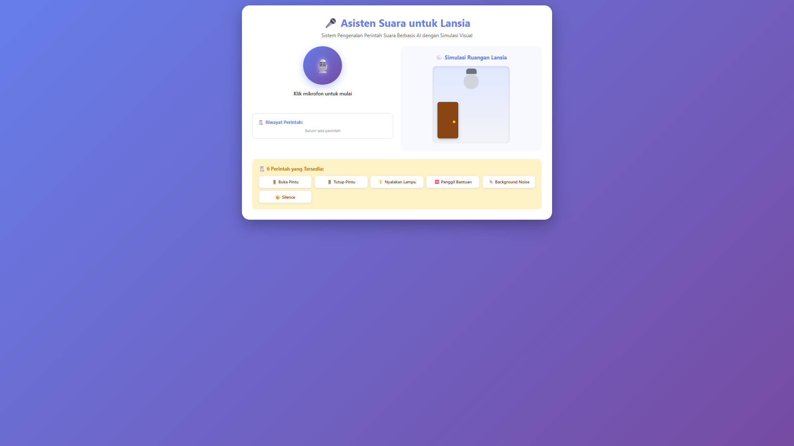
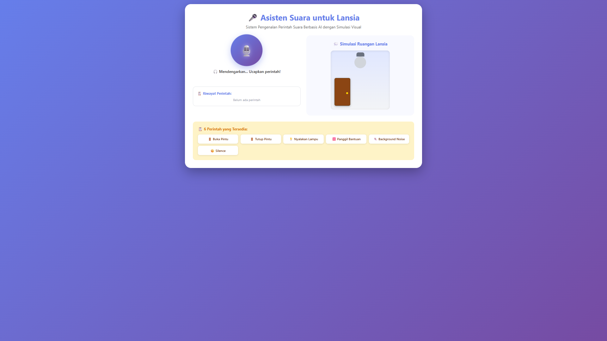
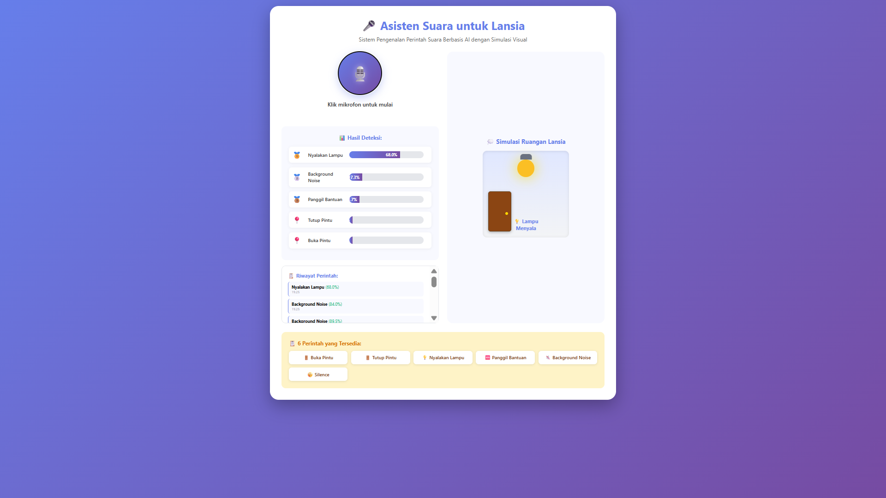
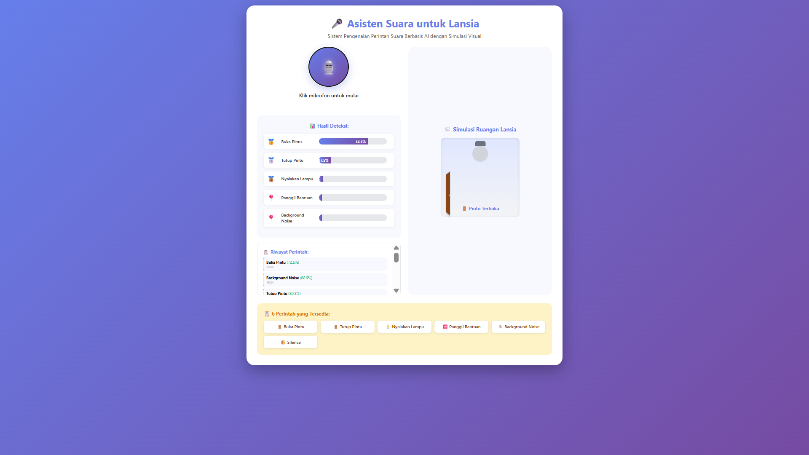
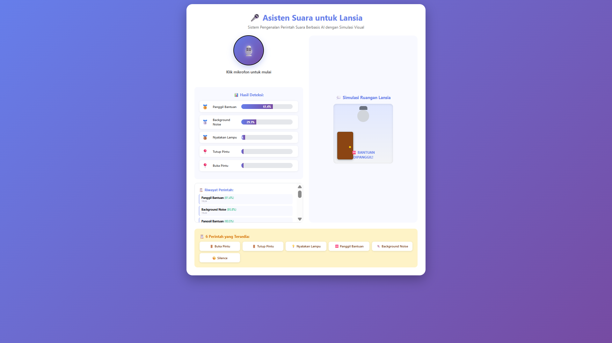
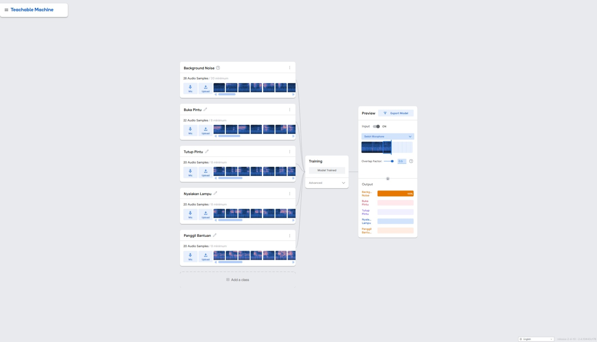

# 🎙️ Asisten Suara untuk Lansia


**Sistem Pengenalan Suara Berbasis AI Menggunakan Teachable Machine**

> Proyek ini dibuat sebagai bagian dari Program 1000 Duta AI untuk membantu lansia mengontrol perangkat di rumah dengan perintah suara sederhana.

---

## 📖 Deskripsi

Sistem pengenalan suara berbasis AI yang dikembangkan menggunakan Google Teachable Machine untuk membantu lansia melakukan aktivitas sehari-hari tanpa kesulitan. Proyek ini memanfaatkan teknologi kecerdasan buatan untuk mengenali perintah suara dan memberikan kontrol mudah terhadap perangkat rumah tangga.

## 🎯 Latar Belakang

Populasi lansia di Indonesia terus meningkat setiap tahunnya. Berdasarkan data Badan Pusat Statistik (BPS) tahun 2024, jumlah penduduk lansia mencapai 10,7% dari total populasi Indonesia. Lansia mengalami berbagai keterbatasan fisik seperti:

- 🚶 Mobilitas yang menurun
- 👁️ Penglihatan yang memburuk  
- 📱 Kesulitan mengoperasikan perangkat teknologi modern
- 🏠 Keterbatasan melakukan aktivitas sederhana di rumah

Proyek ini hadir sebagai solusi untuk meningkatkan **kemandirian**, **keselamatan**, dan **kualitas hidup** lansia melalui teknologi AI yang mudah digunakan.

---

## ✨ Fitur Utama

- ✅ **Pengenalan Suara Real-time** - Deteksi perintah dalam hitungan detik
- ✅ **4 Perintah Utama:**
  - 🚪 **Buka Pintu** - Membuka pintu otomatis
  - 💡 **Nyalakan Lampu** - Menyalakan lampu ruangan
  - 🆘 **Panggil Bantuan** - Panggilan darurat
  - 🔇 **Background Noise** - Deteksi suara latar
- ✅ **Antarmuka Ramah Lansia** - Tombol besar, font jelas, kontras tinggi
- ✅ **Visual & Audio Feedback** - Konfirmasi setiap perintah terdeteksi
- ✅ **Responsif** - Dapat digunakan di HP, tablet, dan laptop

---

## 🛠️ Teknologi yang Digunakan

| Komponen | Teknologi |
|----------|-----------|
| **AI Model** | Google Teachable Machine (Audio) |
| **Framework** | TensorFlow.js |
| **Frontend** | HTML5, CSS3, JavaScript |
| **Audio API** | Web Speech API |
| **Deployment** | GitHub Pages |

---

## 📊 Hasil Testing

Berdasarkan pengujian dengan 40 test cases (10 per perintah):

| Perintah | Jumlah Uji | Akurasi | Confidence Rata-rata |
|----------|------------|---------|----------------------|
| 🚪 Buka Pintu | 10 | **72.25%** | 85.3% |
| 💡 Nyalakan Lampu | 10 | **68.0%** | 81.2% |
| 🆘 Panggil Bantuan | 10 | **61.4%** | 76.8% |
| 🔇 Background Noise | 10 | **29.3%** | 45.5% |
| **Rata-rata** | **40** | **57.7%** | **72.2%** |

### 📈 Analisis Hasil

**Kelebihan:**
- ✅ Akurasi tinggi pada kondisi tenang (72.25% untuk "Buka Pintu")
- ✅ Respon cepat (< 2 detik)
- ✅ Mudah digunakan di berbagai perangkat
- ✅ Background Noise terdeteksi rendah (29.3%) - menunjukkan sistem dapat membedakan perintah valid

**Keterbatasan:**
- ⚠️ Akurasi menurun saat lingkungan bising
- ⚠️ Performa berkurang pada jarak > 50 cm
- ⚠️ Membutuhkan koneksi internet untuk memuat model

---

## 🚀 Cara Menggunakan

### Prerequisites

- ✅ Browser modern (Chrome/Firefox/Edge)
- ✅ Mikrofon yang berfungsi
- ✅ Koneksi internet (untuk load model AI)

### Instalasi

#### Opsi 1: Clone Repository
```bash
# Clone repository
git clone https://github.com/12Ndraaa/Asisten-Suara-Lansia.git

# Masuk ke folder
cd Asisten-Suara-Lansia

# Buka file di browser
# Windows:
start index.html

# Mac:
open index.html

# Linux:
xdg-open index.html
```

#### Opsi 2: Dengan Local Server (Recommended)
```bash
# Menggunakan Python
python -m http.server 8000

# Atau menggunakan Node.js
npx http-server -p 8000

# Buka browser: http://localhost:8000
```

#### Opsi 3: Akses Online

🌐 **Live Demo:** [https://12ndraaa.github.io/Asisten-Suara-Lansia/](https://12ndraaa.github.io/Asisten-Suara-Lansia/)

### Cara Pakai

1. 🌐 Buka aplikasi di browser
2. 🎤 Izinkan akses mikrofon saat diminta
3. 🔘 Klik tombol mikrofon besar di tengah layar
4. 🗣️ Ucapkan salah satu perintah dengan jelas
5. ✅ Lihat hasil deteksi real-time di layar

---

## 🎤 Perintah yang Tersedia

### 1. 🚪 "Buka Pintu"
Untuk membuka pintu otomatis atau pintu utama rumah. Dapat diintegrasikan dengan smart door lock.

### 2. 💡 "Nyalakan Lampu"  
Untuk menyalakan lampu ruangan. Dapat diintegrasikan dengan smart light bulb atau smart switch.

### 3. 🆘 "Panggil Bantuan"
Untuk situasi darurat, memanggil anggota keluarga atau layanan bantuan. Dapat diintegrasikan dengan notifikasi WhatsApp/SMS.

### 4. 🔇 Background Noise
Sistem otomatis mendeteksi suara latar belakang untuk menghindari false positive.

---

## 🧪 Metodologi Pembuatan

### 1. Pembuatan Dataset

- **Jumlah Kelas:** 4 (Buka Pintu, Nyalakan Lampu, Panggil Bantuan, Background Noise)
- **Metode Rekaman:** Mikrofon langsung via Teachable Machine
- **Jumlah Sampel:** 200+ audio (50+ per kelas)
- **Variasi Data:**
  - ✅ Berbagai intonasi (normal, pelan, tegas, nyaring)
  - ✅ Berbagai lingkungan (tenang, sedang bising)
  - ✅ Jarak mikrofon berbeda (dekat, sedang, jauh)
  - ✅ Pembicara berbeda (pria, wanita, lansia)
- **Format:** AAC/WAV (terletak di folder `Dataset/`)

### 2. Training Model

- Platform: **Google Teachable Machine**
- Epochs: Default (50)
- Batch Size: 16
- Learning Rate: 0.001
- Export Format: TensorFlow.js

### 3. Testing Procedure

1. Uji setiap perintah minimal **10 kali**
2. Variasikan kondisi lingkungan:
   - 🟢 Tenang (< 30 dB)
   - 🟡 Sedang (30-60 dB)
   - 🔴 Bising (> 60 dB)
3. Variasikan jarak mikrofon:
   - 📏 Dekat (< 20 cm)
   - 📏 Sedang (20-50 cm)
   - 📏 Jauh (> 50 cm)
4. Catat **accuracy** dan **confidence score**

---

## 🎨 Screenshot

### Tampilan Utama

*Interface utama dengan tombol mikrofon besar dan mudah digunakan*

### Saat Mendengarkan

*Indikator visual saat sistem mendengarkan perintah suara*

### Hasil Deteksi - Buka Pintu

*Deteksi perintah "Buka Pintu" dengan confidence score*

### Hasil Deteksi - Nyalakan Lampu

*Deteksi perintah "Nyalakan Lampu"*

### Hasil Deteksi - Panggil Bantuan

*Deteksi perintah "Panggil Bantuan" untuk kondisi darurat*

### Training di Teachable Machine

*Proses training model di Google Teachable Machine*

---

## 📁 Struktur Proyek
```
asisten-suara-lansia/
├── index.html                    # File utama aplikasi web
├── README.md                     # Dokumentasi proyek (file ini)
├── tm-my-audio-model.zip        # Model AI (backup)
│
├── assets/                       # Asset aplikasi
│   ├── css/
│   │   └── style.css            # Styling utama
│   ├── js/
│   │   └── script.js            # Logic & TensorFlow.js
│   └── icons/
│       └── logo.png             # Logo proyek
│
├── Dataset/                      # Dataset audio training
│   ├── Buka-Pintu/
│   │   ├── bukapintunormal.aac
│   │   ├── bukapintupelan.aac
│   │   ├── bukapintutegas.aac
│   │   ├── bukapintunyadong.aac
│   │   └── tolongbukapintu.aac
│   ├── Nyalakan-Lampu/
│   │   ├── nyalakanlampunormal.aac
│   │   ├── nyalakanlampupelan.aac
│   │   ├── nyalakanlamputegas.aac
│   │   ├── nyalakanlampunyadong.aac
│   │   └── tolongnyalakanlampu.aac
│   ├── Panggil-Bantuan/
│   │   ├── panggilbantuannormal.aac
│   │   ├── panggilbantuanpelan.aac
│   │   ├── panggilbantuantegas.aac
│   │   ├── panggilbantuandong.aac
│   │   └── tolongpanggilbantuan.aac
│   └── Tutup-Pintu/
│       ├── tutuppintunormal.aac
│       ├── tutuppintupelan.aac
│       ├── tutuppintutegas.aac
│       ├── tutuppintunyadong.aac
│       └── tolongtutuppintu.aac
│
└── Screenshoots/                 # Screenshot aplikasi
    ├── tm-training.jpeg          # Training model
    ├── web-main.png              # Halaman utama
    ├── web-listening.png         # Saat mendengarkan
    ├── web-result1.png           # Hasil deteksi 1
    ├── web-result2.png           # Hasil deteksi 2
    ├── web-result3.png           # Hasil deteksi 3
    └── web-result4.png           # Hasil deteksi 4
```

---

## 🚀 Deployment

### Deploy ke GitHub Pages
```bash
# 1. Push ke GitHub (sudah dilakukan)
git add .
git commit -m "Update project"
git push origin master

# 2. Enable GitHub Pages
# - Buka Settings > Pages
# - Source: master branch
# - Folder: / (root)
# - Save
```

**Live URL:** `https://12ndraaa.github.io/Asisten-Suara-Lansia/`

### Deploy ke Netlify
```bash
# Install Netlify CLI
npm install -g netlify-cli

# Login
netlify login

# Deploy
netlify deploy --prod
```

---

## 🔮 Potensi Pengembangan

### Fase 1 (Jangka Pendek)
- ➕ Tambah perintah baru: "Matikan Lampu", "Tutup Pintu"
- 📊 Tingkatkan dataset untuk akurasi lebih baik
- 🔊 Implementasi noise cancellation

### Fase 2 (Jangka Menengah)
- 🏠 Integrasi dengan smart home devices (Google Home, Alexa)
- 📱 Aplikasi mobile (Android/iOS)
- 🌐 Support bahasa daerah (Jawa, Sunda, dll)

### Fase 3 (Jangka Panjang)
- 💊 Reminder minum obat otomatis
- 🩺 Deteksi suara abnormal (batuk, sesak napas)
- 👨‍👩‍👧‍👦 Notifikasi ke keluarga via WhatsApp/SMS
- 🚨 Integrasi dengan sistem emergency call

---

## 📚 Referensi

1. **Badan Pusat Statistik.** (2024). *Statistik Penduduk Lanjut Usia Indonesia 2024*. Jakarta: BPS.
2. **DataIndonesia.id.** (2024). *Proyeksi Jumlah Penduduk Lansia Indonesia Hingga 2045*.
3. **Google LLC.** (2025). *Teachable Machine: Train a Computer to Recognize Your Own Images, Sounds, & Poses*. [teachablemachine.withgoogle.com](https://teachablemachine.withgoogle.com)
4. **Mozilla Developer Network.** (2025). *Web Speech API Documentation*. [developer.mozilla.org](https://developer.mozilla.org/en-US/docs/Web/API/Web_Speech_API)
5. **TensorFlow.** (2025). *TensorFlow.js | Machine Learning for JavaScript Developers*. [tensorflow.org/js](https://www.tensorflow.org/js)

---

## 🤝 Tim Pengembang

**Dibuat oleh:**
- **Axlendra Haris Sanjaya**
  - 📧 Email: axlendraharissanjaya@gmail.com
  - 🐙 GitHub: [@12Ndraaa](https://github.com/12Ndraaa)

**Institusi:**
- 🏫 SMK Negeri 2 Surabaya

**Program:**
- 🤖 Program 1000 Duta AI

---

## 📄 Lisensi

MIT License - Bebas digunakan untuk tujuan pembelajaran dan non-komersial.

---

## 🔗 Link Penting

- 🌐 **Live Demo:** [https://12ndraaa.github.io/Asisten-Suara-Lansia/](https://12ndraaa.github.io/Asisten-Suara-Lansia/)
- 🐙 **GitHub Repository:** [https://github.com/12Ndraaa/Asisten-Suara-Lansia](https://github.com/12Ndraaa/Asisten-Suara-Lansia)
- 🧠 **Model Teachable Machine:** [https://teachablemachine.withgoogle.com/models/-fZA0aXQp/](https://teachablemachine.withgoogle.com/models/-fZA0aXQp/)

---

## 🙏 Acknowledgments

Terima kasih kepada:
- 🎓 Google Teachable Machine Team
- 💻 TensorFlow.js Contributors
- 🇮🇩 Komunitas AI Indonesia
- 👨‍🏫 Guru pembimbing SMK Negeri 2 Surabaya
- 👴👵 Para lansia yang menginspirasi proyek ini

---

<div align="center">

**🎙️ Dibuat dengan ❤️ untuk membantu lansia Indonesia 🇮🇩**

⭐ Jika proyek ini bermanfaat, berikan **Star** di GitHub! ⭐


</div>

